# Machine Learning Model

## Objective

The developed machine learning model is trained on Sentinel-2 satellite images and is capable of identifying various building typologies within a geography. The envisioned priority tree for building classification is shown in [Figure 1](#classification_tree). By progressing down the classification tree, the model should be able to classify a broader variety of building types.

In the current state of Open Building Insights the model is operating at the 1st priority level and is therefore capable of classifying buildings as either **residential** or **non-residential** within two countries: Kenya and India. Implementations of higher priority levels and therefore enabling a more granular building type resolution is planned for the future (see section [Future Improvements and Extensions](#future_improvements)).

<a id="classification_tree"></a>
<figure>
  
  <figcaption>Figure 1: Priority tree for the building type classification: The machine learning model should be able to correctly classify a broader varitey of building types as the priority increases (going down the tree from top to bottom).</a></figcaption>
</figure>

## Model Selection and Architecture
<a id="model"></a>

### Base Model
<a id="base_model"></a>

A custom neural network architecture based on the DenseNet121 model with preloaded imagenet weights is chosen as base model for given classification task. 
The DenseNet121 model is a specific variant of the DenseNet architecture, which is a convolutional neural network (CNN) designed for image classification tasks. 
The model was first introducted in [Huang et al. (2017)](https://arxiv.org/abs/1608.06993).
The DenseNet architecture is characterized by multiple dense blocks separated by transition layers, which reduce the feature-map sizes (spatial dimensions, i.e. width and height) through convolution and pooling operations.
A sketch of such a sequence taken from the original paper is shown in [Figure 2](#densenet_architecture).
A dense block is constructed such that each layer receives input from all preceding layers. 
Therefore, the feature maps from all previous layers are concatenated and used as input for the current layer.
All layers in the DenseNet121 base model are set to be trainable. 
In this way, during training, the weights of the layers in the model will be updated to better suit our specific task.

<a id="densenet_architecture"></a>
<figure>
  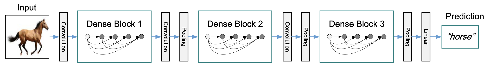
  <figcaption>Figure 2: Example of a DenseNet architecture: Three dense blocks with transition layers (performing convolution and pooling) between two adjacent blocks. Source: Figure 2 in <a href="https://arxiv.org/abs/1608.06993">Huang et al. (2017)</a>.</figcaption>
</figure>

### Custom Hybrid Model
<a id="hybrid_model"></a>

Using the afore mentioned base model architecture, with consideration of numeric inputs importance a new hybrid model architecture is proposed. This new model architecture takes to consideration two types of input: visual and numeric. Visual input remains the same as it was on the base model, the cropped image of building footprint from Sentinel2 satellite. The numeric input is represented by the array of chosen numeric values, metadata describing the building in question. Analyzing the labeled data set showed, that the most impactful numeric features affecting the model are building footprint area and SMOD id number. Therefore, the result model architecture looks the following way:

<a id="custom_hybrid_architecture"></a>
<figure>
  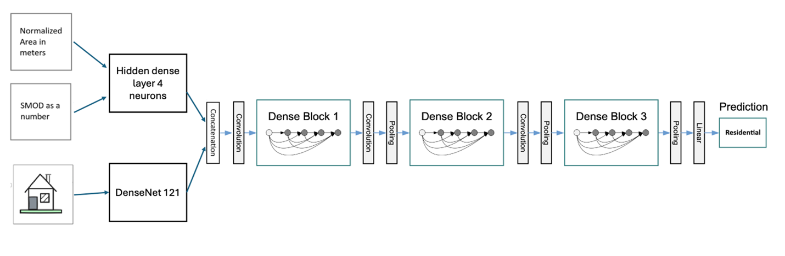
  <figcaption>Figure 3: Example of the custom hybrid architecture using three different inputs with Dense Blocks.</figcaption>
</figure>

### Configuration of Top-Layers

A functional model is created with the pre-trained non-frozen DenseNet121 base model as visual input receiver and numeric input receiver with one hidden layer which consists of 4 neurons. Further layers are then be added after concatenation for classification and output:

- A Global Average Pooling layer is added to reduce the spatial dimension of the feature maps from the previous layer. It computes the average value for each feature map, resulting in a single value per feature map.

- A separate numeric part hidden layer receive input from ‘numeric_input (InputLayer)’ with shape [(None, 2)], a vector with two numbers.

- Three dropout layers with ```rate=0.4``` are used. 
During each training iteration, a different random subset of 40% of the input units are set to zero ("dropped out"). This helps prevent the network from becoming too reliant on a specific set of neurons and promotes more robust learning. Dropout layers are a powerful tool for improving the generalization ability of neural networks, especially in cases where you have limited training data or very complex models. They help prevent the network from memorizing the training data and encourage it to learn more robust and representative features.

- Three densely connected layers with eLU activations are used. ```units=[200, 100, 50]``` are used for the three layers (in this sequence), which progressively reduce the number of neurons.

- •	A final dense output layer with a single neuron and a sigmoid activation function is used for binary classification.

[Table 1](#table_1): Summary of the final architecture used

<div class="arch_table">
<a id="table_1"></a>

| Layer (type) | Output Shape | Param # | Layer note |
| --- | --- | --- | --- |
| densenet121 (Functional) | (None, 3, 3, 1024) | 7037504 | Image input |
| global_average_pooling2d (GlobalAveragePooling2D) |  | 0 | Receive input from DenseNet121 basemodel |
| numeric_input (InputLayer) | (None, 2) | 0 | Input for numeric vector |
| dense | (None, 4) | 12 | Hidden layer for numeric input |
| concatenate | (None, 1028) | 0 | Concat outputs from GlobalAveragePooling2D and numeric_input hidden layer |
| dropout (Dropout) | (None, 1028) | 0 | Receive input from concatenation layer |
| dense_1 (Dense) | (None, 200) | 205800 |  |
| dropout_1 (Dropout) | (None, 200) | 0 |  |
| dense_2 (Dense) | (None, 100) | 20100 |  |
| dropout_2 (Dropout) | (None, 100) | 0 |  |
| dense_3 (Dense) | (None, 50) | 5050 |  |
| dense_4 (Dense) | (None, 1) | 51 |  |
| Total params: 7,268,517 | Trainable params: 7,184,869 | Non-trainable params: 83,648 |  |

</div>

Legend:

Blue – image layers <br/>
Orange – numeric layers <br/>
Violet – concatenation layer of image output and numeric output <br/>
Green – classification hidden layers <br/>
Yellow – output layer.

## Training and Evaluation

The model described in [Model Selection and Architecture](#model) is trained on an imbalanced data set consisting of around 90000 labeled building data for Kenya, containing twice as much **residential** than **non-residential** buildings and around 90000 labeled building data for India having a fairly balanced data set of around 1.5 times more **residential** than **non-residential** buildings. Of all labelled images, 70% are used for training (initial fit) and 20% for validating (fine-tuning) the model (see section [Final Configuration and Results](#final_config)). The remaining 10% are used for testing (i.e. consist of independent, unseen data). The model configurations are fine-tuned after validation, as schematically depicted in [Figure 4: Schematic overview of the model training process](#model_training_design), and saved upon achieving satisfactory performance.

<a id="model_training_design"></a>
<figure>
  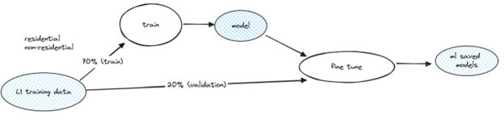
  <figcaption>Figure 4: Schematic overview of the model training process: 70% of the images used are used for training and 20% are used for validation.</figcaption>
</figure>

The resulting model is then tested using previously unseen data and the model scores are computed (see [Figure 5: Schematic overview of the model evaluation process](#model_evaluation_design)).
The Adam optimizer with a learning rate of 0.001 and the binary cross-entropy are used as the optimization algorithm and loss function respectively for training the neural network.
Furthermore, a learning rate reduction callback is used: This callback will monitor the validation accuracy and if it stops improving, it will reduce the learning rate to help the model converge better. The model is trained for 50 epochs, whereas the training data is shuffled before each epoch. The following metrics are monitored during training:
- classification accuracy
- true positives
- true negatives
- false positives
- false negatives
- precision and recall
- area under curve (AUC)
- precision-recall curves

<a id="model_evaluation_design"></a>
<figure>
  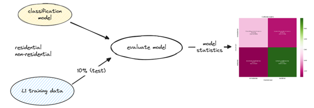
  <figcaption>Figure 5: Schematic overview of the model evaluation process: The remaining 10% of the labelled data is used for testing of the classification model. The associated model scores (e.g. confusion matrix) are computed.</figcaption>
</figure>

## Overview of the Exploratory Phases
<a id="intermediate_config"></a>

During two exploratory phases different models architectures and configurations were trialed to find the best performing setup. 

During the first exploratory phase different configurations of the model presented in Section [Base Model](#base_model) were tested.

The tested intermediate configurations are shown in [Table 2](#table_2).
Note that at the time when the experiments with configuration IDs CFG005, CFG006 and CFG008 were performed, only ~30k images were at our disposal for training, validation and testing of the model. In particular, only ~100 images were used to test the model.

<a id="table_2"></a>
<table>
<caption>Table 2: Intermediate parameter configurations and model scores for the model based on DenseNet121.</caption>
  <tr>
    <th>Configuration ID</th>
    <th>Hyperparameters</th>
    <th>Other Parameters</th>
    <th>Model Scores</th>
  </tr>
  <tr>
    <td rowspan="6">CFG005</td>
    <td>balanced_dataset = True</td>
    <td></td>
    <td>Val accuracy: 0.9022</td>
  </tr>
  <tr>
    <td>train-validation split: 75:25 (~100 images for testing)</td>
    <td></td>
    <td>Val precision: 0.9688</td>
  </tr>
  <tr>
    <td>Adam optimizer</td>
    <td></td>
    <td>Val recall: 0.9125</td>
  </tr>
  <tr>
    <td>init_learning_rate = 0.001</td>
    <td></td>
    <td>F1 val score: 0.9398</td>
  </tr>
  <tr>
    <td>dropout_rate = 0.4</td>
    <td></td>
    <td></td>
  </tr>
  <tr>
    <td>epochs = 50</td>
    <td></td>
    <td></td>
  </tr>
  <tr>
    <td rowspan="8">CFG006</td>
    <td>balance_dataset = False</td>
    <td></td>
    <td>Train accuracy: 0.9267</td>
  </tr>
  <tr>
    <td>train-validation split: 75:25 (~100 images for testing)</td>
    <td></td>
    <td>Val accuracy: 0.8839</td>
  </tr>
  <tr>
    <td>Adam optimizer</td>
    <td></td>
    <td>F1 train score: 0.9568</td>
  </tr>
  <tr>
    <td>init_learning_rate = 0.001</td>
    <td></td>
    <td>F1 val score: 0.927</td>
  </tr>
  <tr>
    <td>dropout_rate = 0.4</td>
    <td></td>
    <td></td>
  </tr>
  <tr>
    <td>epochs = 50</td>
    <td></td>
    <td></td>
  </tr>
  <tr>
    <td>base model trainable = True</td>
    <td></td>
    <td></td>
  </tr>
  <tr>
    <td>early stopping added with patience = 4, min. delta = 0.001 and monitoring</td>
    <td></td>
    <td></td>
  </tr>
  <tr>
    <td rowspan="8">CFG008</td>
    <td>balance_dataset = False</td>
    <td></td>
    <td>Train accuracy: 0.9602</td>
  </tr>
  <tr>
    <td>batch_size = 32</td>
    <td></td>
    <td>Val accuracy: 0.8899</td>
  </tr>
  <tr>
    <td>train-validation split: 70:30 (~100 images for testing)</td>
    <td></td>
    <td>F1 train score: 0.9764</td>
  </tr>
  <tr>
    <td>Adam optimizer</td>
    <td></td>
    <td>F1 val score: 0.9316</td>
  </tr>
  <tr>
    <td>init_learning_rate = 0.001</td>
    <td></td>
    <td></td>
  </tr>
  <tr>
    <td>dropout_rate = 0.4</td>
    <td></td>
    <td></td>
  </tr>
  <tr>
    <td>epochs = 50</td>
    <td></td>
    <td></td>
  </tr>
  <tr>
    <td>base model trainable = True</td>
    <td></td>
    <td></td>
  </tr>
</table>

An alternative model based on a ResNet50 architecture with preloaded ImageNet weights and modified image shape [124, 124, 3] is tested. 
ResNet50 is a 50-layer deep neural network first introduced in [He et al. (2017)](https://arxiv.org/abs/1512.03385), characterized by its frequent use of residual connections.
The fundamental building block of ResNet is the residual block. Each block contains two main paths: the identity path and the shortcut path. The identity path simply passes the input forward, while the shortcut path applies a transformation. These paths are then added together.
In ResNet50, the architecture uses bottleneck blocks in order to reduce the computational complexity. These blocks consist of three convolutional layers: 1x1, 3x3, and 1x1, where the 1x1 convolutions are used to reduce and then restore the dimensions.
Furthermore, it uses global average pooling instead of fully connected layers at the end of the network. This reduces the number of parameters and helps with generalization.
The final layer of ResNet50 is typically a fully connected layer with as many neurons as there are classes in the dataset.

Two methods of model tuning are implemented: "Manual" and "Optimize". The Optimize mode uses the keras BayesianOptimization tuner for hyperparameter optimization 
(i.e. on "val_accuracy", "val_loss", "val_prc"). In this mode Bayesian optimization is used to search for optimal dropout rate and learning rate.
In Manual mode, a base model and the final model are built with specified dropout rate and learning rate. Furthermore, in Manual mode, the model is trained for a specified number of epochs for feature extraction.

The last experiment conducted using the model based on ResNet50 is based on the parameters shown in [Table 3](#table_3) and yielded the confusion matrix displayed in [Figure 5](#confusion_final_baseline_model). The history of the model scores for this experiment is shown in [Figure 6](#CFG010_baseline_history).

<a id="table_3"></a>
<table>
<caption>Table 3: Last tested parameter configurations and model scores for the model based on ResNet50.</caption>
  <tr>
    <th>Configuration ID</th>
    <th>Hyperparameters</th>
    <th>Other Parameters</th>
    <th>Model Scores</th>
  </tr>
  <tr>
    <td rowspan="7">CFG009 (ResNet50)</td>
    <td>balance_dataset = False</td>
    <td>43k images for training</td>
    <td>Test accuracy: 0.9106</td>
  </tr>
  <tr>
    <td>batch_size = 32</td>
    <td>12k images for validation</td>
    <td>Test precision: 0.913</td>
  </tr>
  <tr>
    <td>mode = "Manual"</td>
    <td>Optimize on “val accuracy”</td>
    <td>F1 test score: 0.95</td>
  </tr>
  <tr>
    <td>train-val-test split: 70:20:10</td>
    <td>Without finetuning</td>
    <td>Test recall: 0.9902</td>
  </tr>
  <tr>
    <td>base_learning_rate = 0.002</td>
    <td></td>
    <td></td>
  </tr>
  <tr>
    <td>dropout_rate = 0.4</td>
    <td></td>
    <td></td>
  </tr>
  <tr>
    <td>epochs = 80</td>
    <td></td>
    <td></td>
  </tr>
  <tr>
    <td>base model trainable = True</td>
    <td></td>
    <td></td>
  </tr>
</table>

<a id="confusion_final_baseline_model"></a>
<figure>
  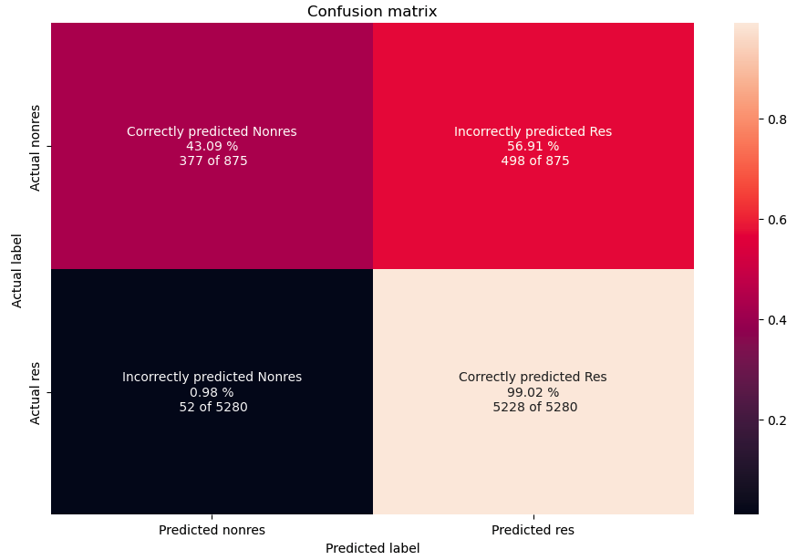
  <figcaption>Figure 6: Confusion matrix of the last experiment using the model based on ResNet50. It provides a visual representation of the models performance in classifying residential and non-residential buildings.</figcaption>
</figure>
<a id="CFG010_baseline_history"></a>
<figure>
  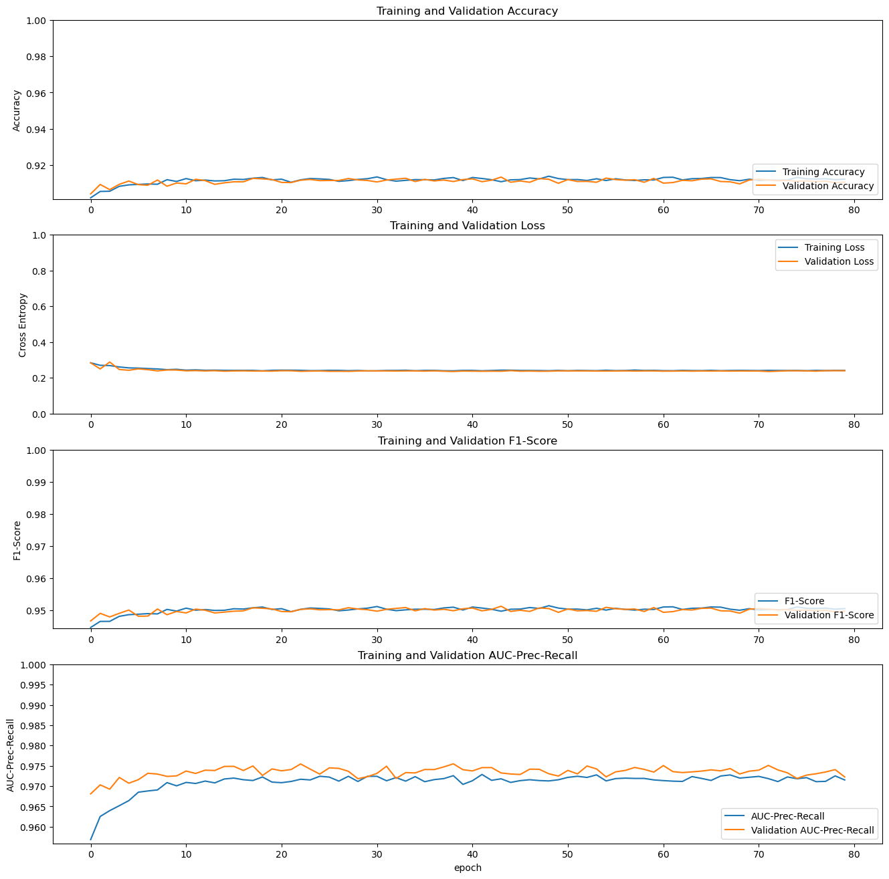
  <figcaption>Figure 7: History of the model scores through learning epochs of the lastest experiment using the model based on ResNet50. The model scores for accuracy, cross entropy, F1-score and AUC-prec-recall are shown for training (blue) and validation (orange).</figcaption>
</figure>

During the second exploratory phase different intermediate configurations of the model presented in Section [Custom Hybrid Model](#hybrid_model) have been tested prior to settling to the configurations layer out in [Final Configuration and Results](#final_config).

The tested intermediate configurations are shown in [Table 4: Intermediate parameter configurations and model scores for the model based on Hybrid architecture](#table4). Note, that at the time when the experiments with configurations were performed, ~70k images were at our disposal for training, validation and testing of the model.

<a id="table_4"></a>
<table>
<caption>Table 4: Intermediate parameter configurations and model scores for the model based on Hybrid architecture.</caption>
  <tr>
    <th>Configuration ID</th>
    <th>Hyperparameters</th>
    <th>Model Scores</th>
  </tr>
  <tr>
    <td>CFG005 <br/>
    DenseNet121_L1_5INP <br/>
    RUN 3</td>
    <td>-	train-validation split: 70:20 <br/>
    -	Adam optimizer <br/>
    -	init_learning_rate = 0.001 <br/>
    -	dropout_rate = 0.4 <br/>
    -	epochs = 20 <br/>
    -	inputs - image, area, height, junction, SMOD <br/>
    -	Dataset ver 1
    </td>
    <td>-	Val accuracy: 0.867 <br/>
    -	Val precision: 0.8988 <br/>
    -	Val recall: 0.9245 <br/>
    -	F1 val score: 0.91
    </td>
  </tr>
  <tr>
    <td>CFG005 <br/>
    DenseNet121_L1_5INP <br/>
    RUN 5</td>
    <td>-	train-validation split: 70:20 <br/>
    -	Adam optimizer <br/>
    -	init_learning_rate = 0.001 <br/>
    -	dropout_rate = 0.4 <br/>
    -	epochs = 20 <br/>
    -	inputs - image, area, height, junction, SMOD <br/>
    -	Dataset ver 2
    </td>
    <td>-	Val accuracy: 0.876 <br/>
    -	Val precision: 0.8929 <br/>
    -	Val recall: 0.9307 <br/>
    -	F1 val score: 0.91
    </td>
  </tr>
  <tr>
    <td>CFG005 <br/>
    DenseNet121_L1_5INP <br/>
    RUN 8</td>
    <td>-	train-validation split: 70:20 <br/>
    -	Adam optimizer <br/>
    -	init_learning_rate = 0.001 <br/>
    -	dropout_rate = 0.4 <br/>
    -	epochs = 20 <br/>
    -	inputs - image, area, SMOD <br/>
    -	Dataset ver 2
    </td>
    <td>-	Val accuracy: 0.875 <br/>
    -	Val precision: 0.887 <br/>
    -	Val recall: 0.9349 <br/>
    -	F1 val score: 0.91
    </td>
  </tr>
</table>

## Final Model, Its Configuration and Results
<a id="final_config"></a>

### Kenya

The final configuration and associated experiment results can be seen in [Table 5: Final and accepted parameter configurations and model scores for the model based on Hybrid architecture](#table_5). About ~66k images are used for training and about 18.8k images are used for the validation of the model. The trained model is then tested on a previously unseen test-dataset, where we observed a test accuracy of 0.8713 and a test F1-score of 0.907. The corresponding confusion matrix and history of model scores are shown in [Figure 8: Confusion matrix of the final setup using the model based on Hybrid architecture](#confusion_final_custom_model) and [Figure 9: History of the model scores through learning epochs of the final experiment using the model based on Hybrid architecture](#custom_history), respectively.

<a id="table_5"></a>
<table>
<caption>Table 5: Final and accepted parameter configurations and model scores for the model based on Hybrid architecture from RUN 8</caption>
  <tr>
    <th>Configuration ID</th>
    <th>Hyperparameters</th>
    <th>Other Parameters</th>
    <th>Model Scores</th>
  </tr>
  <tr>
    <td>CFG005 <br/>
    DenseNet121_L1_5INP <br/>
    RUN 8</td>
    <td>-	train-validation split: 70:20 <br/>
    -	Adam optimizer <br/>
    -	init_learning_rate = 0.001 <br/>
    -	dropout_rate = 0.4 <br/>
    -	epochs = 20 <br/>
    -	inputs - image, area, SMOD
    </td>
    <td>
    -	Dataset version 2 with removing buildings from defined regions
    </td>
    <td>-	Val accuracy: 0.875 <br/>
    -	Val precision: 0.887 <br/>
    -	Val recall: 0.9349 <br/>
    -	F1 val score: 0.91
    </td>
  </tr>
</table>

<a id="confusion_final_custom_model"></a>
<figure>
  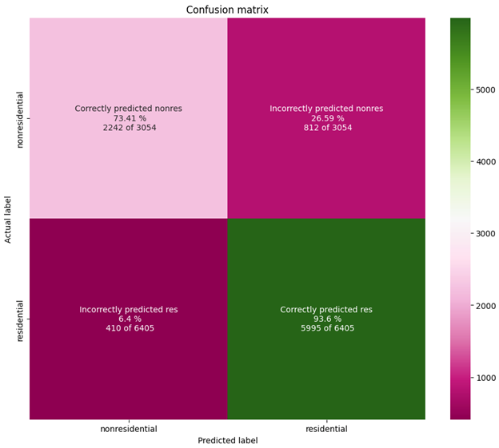
  <figcaption>Figure 8: Confusion matrix of the final setup using the model based on Hybrid architecture RUN8: It provides a visual representation of the models performance in classifying residential and non-residential buildings.</figcaption>
</figure>

<a id="custom_history"></a>
<figure>
  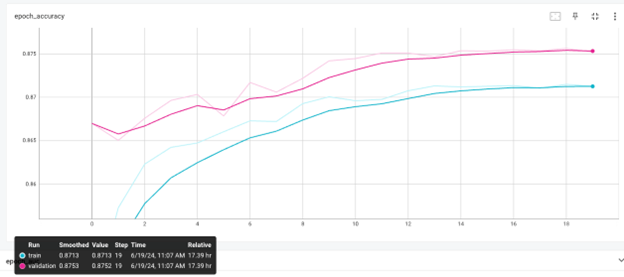
  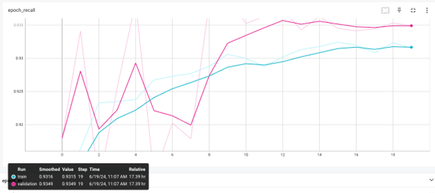
  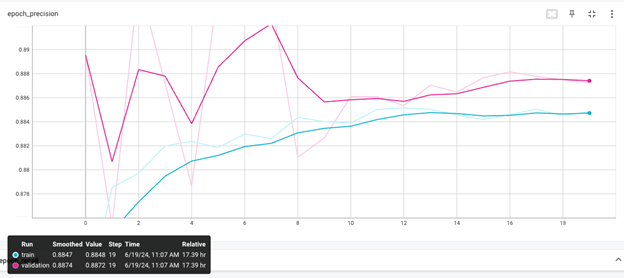
  <figcaption>Figure 9: History of the model scores through learning epochs of the final experiment using the model based on Hybrid architecture RUN8: The model scores for accuracy, precison and recall are shown for training (blue) and validation (pink).</figcaption>
</figure>

To validate the model its prediction was compared to building data from Nairobi obtained by matching electricity meters to buildings and assigning the building type based on the available meter types: residential and non-residential. This validation was conducted on around 85000 buildings from Nairobi, the results are shared below. In the sample data set there is a huge bias towards residential buildings. Similar validation effort was conducted in the county of Makueni in Kenya as well, with similar results, but much lower sample size.

<figure>
  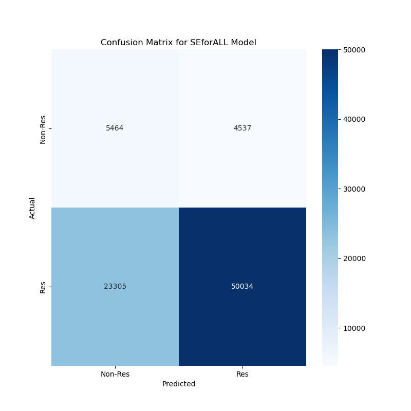
  <figcaption>Figure 10: Confusion matrix created by comparing model predictions to real building data</figcaption>
</figure>

<figure>
  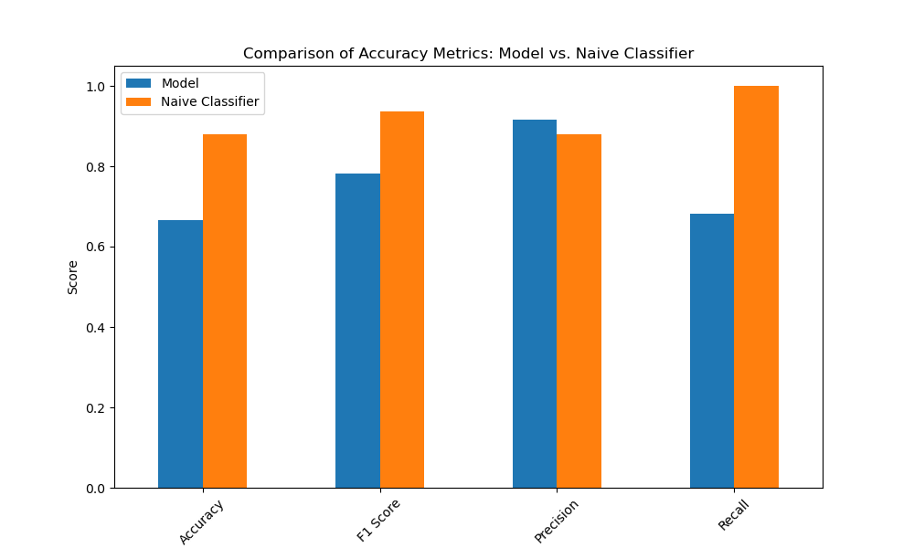
  <figcaption>Figure 11: Key attributes of the model compared to a naive classifier on Nairobi ground data</figcaption>
</figure>

### India

Using the data curation process ~65k labeled buildings were obtained for Maharashtra state. Implementing the aforementioned approach for model training a new model for India (Maharashtra state) was trained based on the custom hybrid architecture with the following configuration and results. From model scores below promising precision can be observed from the first shot of learning.

<a id="table_6"></a>
<table>
<caption>Table 6: Final and accepted parameter configurations and model scores for the model based on Hybrid architecture from RUN 1 for India</caption>
  <tr>
    <th>Configuration ID</th>
    <th>Hyperparameters</th>
    <th>Other Parameters</th>
    <th>Model Scores</th>
  </tr>
  <tr>
    <td>CFG001_India_Maharashtra <br/>
    DenseNet121_L1_1I_2N <br/>
    RUN 1
    </td>
    <td>-	train-validation split: 70:20 <br/>
    -	Adam optimizer <br/>
    -	init_learning_rate = 0.001 <br/>
    -	dropout_rate = 0.4 <br/>
    -	epochs = 20 <br/>
    -	inputs - image, area, SMOD
    </td>
    <td>
    -	Dataset version 1 with reduced amount of  industrial buildings
    </td>
    <td>-	Val accuracy: 0.8159 <br/>
    -	Val precision: 0.8091 <br/>
    -	Val recall: 0.9011 <br/>
    -	F1 val score: 0.8526
    </td>
  </tr>
</table>

<a id="confusion_final_custom_model_india"></a>
<figure>
  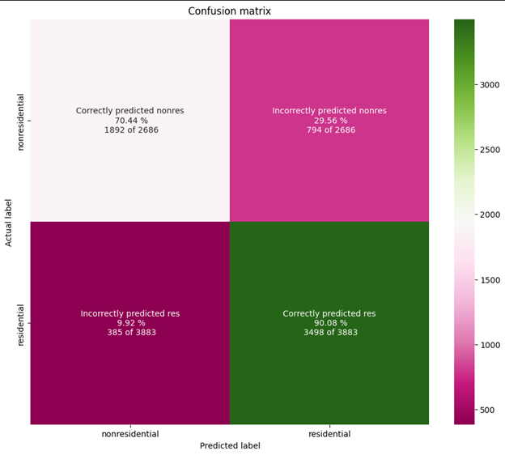
  <figcaption>Figure 12: The confusion matrix for test part of the dataset for Maharashtra RUN1: It provides a visual representation of the models performance in classifying residential and non-residential buildings from the test part of the dataset.</figcaption>
</figure>

<a id="custom_history_india"></a>
<figure>
  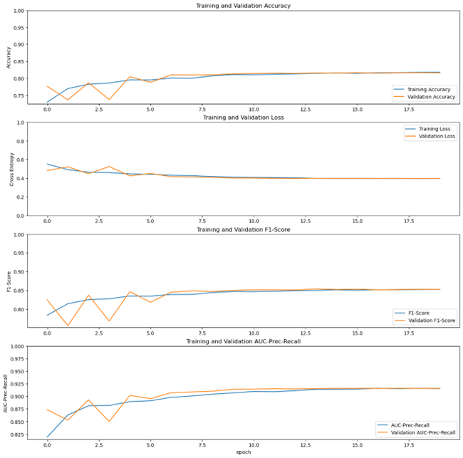
  <figcaption>Figure 13: A graph of training and validation from Maharashtra model RUN1: The model scores for accuracy, loss, F1-score and AUC curve are shown for training (blue) and validation (orange).</figcaption>
</figure>

## Future Improvements and Extensions

<a id="future_improvements"></a>

The current machine learning model could be improved / extended in these areas:
-	Extend building footprint information by exploring and utilizing additional geospatial layers
-	Extend classification tree to 2nd layer to classify non-residential buildings as public, industrial or commercial.

## Fine-Grained Building Classification Using High-Resolution Imagery

During an internal proof of concept it was shown, that the Custom Hybrid Model architecture is capable of a three-way classification into Residential, Industrial and Other non-residential categories when trained using high-resolution satellite imagery of 1.1 meter per pixel resolution. The model was configured the same way as the model described in Section [Final Model, Its Configuration and Results](#final_config) having 7,184,869 trainable parameters.

The performance of the model was compared against the distribution of buildings in Nairobi based on Kenya Power Annual Report, according to which 94,75% of buildings is residential, 4,94% is non-residential and 0,31% is industrial.

The model resulted in over-estimating the industrial segment, classifying 74% residential, 6,5% non-residential and 19,5% industrial buildings, but it was shown that by proper data curation the accuracy of the model can be improved. Moreover, the model was able to find the industrial and business districts in Nairobi only based on the building image and metadata, despite not being trained based on the landuse provided by OSM.


## Implementation Details

The list of most important libraries is provided:

| Package Name | Version | Short Description |
| --- | --- | --- |
| pandas | 1.5.3 | Powerful data structures for data analysis, time series, and statistics |
| numpy | 1.23.5 | Fundamental package for array computing in Python |
| ibm_boto3 |  | The IBM SDK for Python |
| botocore | 1.27.59 | Low-level, data-driven core of boto 3. |
| ibm_cloud_sdk_core | 3.20.3 | Core library used by SDKs for IBM Cloud Services |
| threading | default | Standard threading module |
| tensorflow | 2.17.0 | TensorFlow is an open source machine learning framework for everyone |
| scikit-learn | 1.5.1 | A set of python modules for machine learning and data mining |
| Keras | 3.4.1 | Deep Learning for Humans |

## Execution Details

To execute the model training process the following notebooks are executed in order:

1.	L1_poly_inputs_Sentinel_data.ipynb

**convert_models_to_js.ipynb** provides an utility to convert the Python trained model into a javascript model, so that it can be hosted and accessed by the front-end APIs.

## Conclusion

Three different base model architectures were tested and optimized: Custom models based on pre-trained ResNet50 or DenseNet121 base models with added custom layers and a Custom Hybrid architecture. All model architectures were configured, trained and tested in several experiments, which are presented in sections [Overview of the Exploratory Phases](#intermediate_config) and [Final Model, Its Configuration and Results](#final_config).

The best model scores were achieved using a Custom Architecture base model as shown in section [Model Selection and Architecture](#model). The final configuration is based on using an Adam optimizer, an initial learning rate of 0.001, dropout_rate of 0.4 and 20 epochs.

